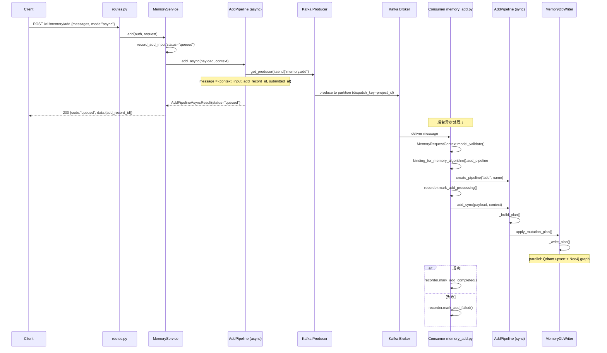
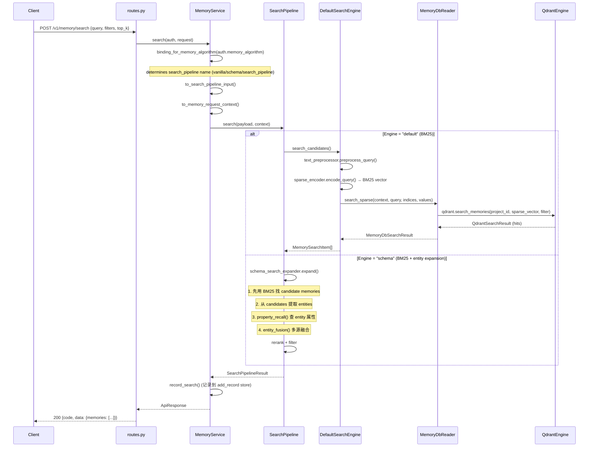
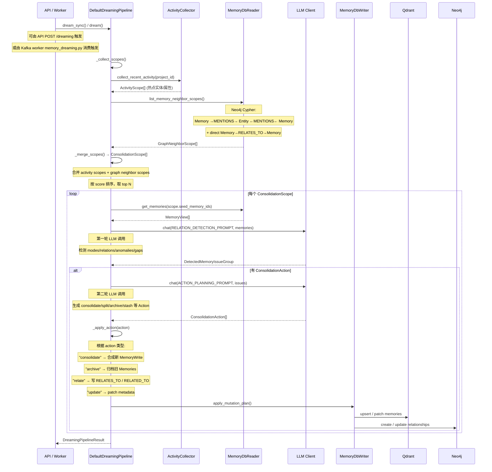
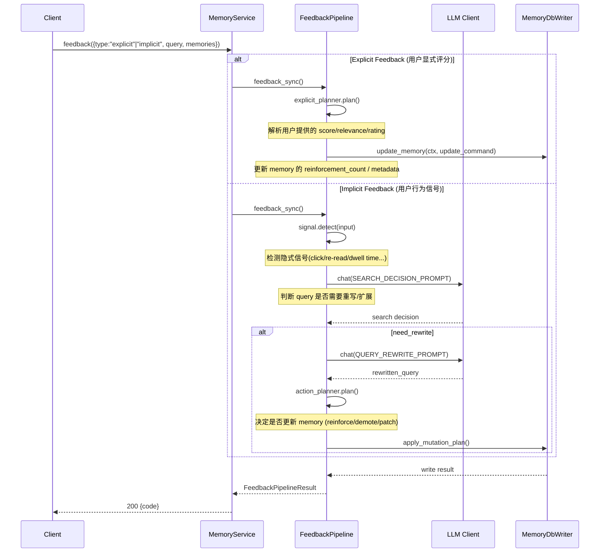
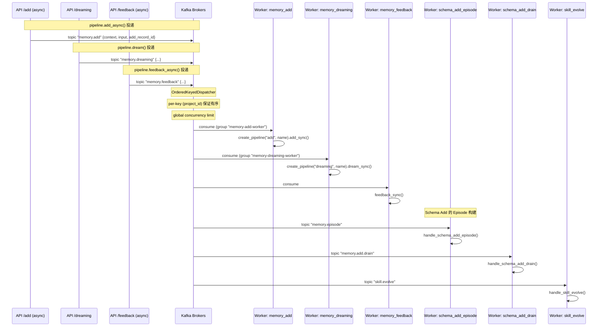

# MindMemOS 模块互联架构与核心时序

> 基于 `src/mindmemos/mindmemos/` 全量 Python 源码分析。

---

## 1. 模块互联：五层依赖 + 事件总线

### 1.1 分层架构总览

```mermaid
graph TB
    subgraph "L1 - API Layer (api/)"
        RT["routes.py<br/>HTTP endpoints"]
        IR["internal_routes.py<br/> internal API"]
        SR["skill_routes.py"]
        SVC["services/memory_service.py<br/>Stateless facade"]
        DEPS["deps.py<br/>Auth chain"]
    end

    subgraph "L2 - Pipeline Layer (pipelines/)"
        REG["registry.py<br/>Global dict: {type: {name: class}}"]
        BASE["base.py<br/>MemoryDbPipelineMixin"]
        ADD["add/"]
        SEARCH["search/"]
        DREAM["dreaming/"]
        FEEDBACK["feedback/"]
        GET["get/"], DEL["delete/"], UPD["update/"]
        MEMDB["memory_db/"]
    end

    subgraph "L3 - Component Layer (components/)"
        EXTR["extractor/"]
        CHUNK["chunker/"]
        SEARCHC["searcher/"]
        MM["memory_modeling/"]
        DREAMC["dreaming/"]
        FEEDBACKC["feedback/"]
        ACTIVITY["activity/"]
        TEXT["text/"]
        KAFKA["kafka/ (dispatch key)"]
    end

    subgraph "L4 - Infrastructure Layer (infra/)"
        DB["db/"]
        KAFKA_INFRA["kafka/"]
        TELE["telemetry/"]
        RETRY["retry/"]
    end

    subgraph "L5 - Foundation Layer"
        TYPING["typing/ (DTOs)"]
        CONFIG["config/"]
        LLM["llm/"]
        LOG["logging/"]
        MAPPERS["mappers/"]
        ERRORS["errors/"]
    end

    subgraph "Worker Processes (workers/)"
        W_ADD["memory_add.py"]
        W_DREAM["memory_dreaming.py"]
        W_FB["memory_feedback.py"]
        W_DRAIN["schema_add_drain.py"]
        W_EP["schema_add_episode.py"]
        W_SKILL["skill_evolve.py"]
    end

    RT --> DEPS
    DEPS -->|"resolve_api_key()"| SVC
    RT --> SVC
    IR --> SVC
    SR --> SVC

    SVC -->|"create_pipeline(type,name)"| REG
    SVC -->|"binding_for_memory_algorithm()"| ALGO["api/algorithm.py"]
    ALGO -->|"vanilla→vanilla_add/vanilla<br/>schema→schema_add/schema"| REG

    REG -->|"instantiate"| ADD
    REG -->|"instantiate"| SEARCH
    REG -->|"instantiate"| DREAM
    REG -->|"instantiate"| FEEDBACK
    REG -->|"instantiate"| GET
    REG -->|"instantiate"| DEL
    REG -->|"instantiate"| UPD

    BASE -->|"provides"| ADD
    BASE -->|"provides"| SEARCH
    BASE -->|"provides"| DREAM
    BASE -->|"provides"| FEEDBACK
    BASE -->|"provides"| GET
    BASE -->|"provides"| DEL
    BASE -->|"provides"| UPD

    ADD -->|"use"| TEXT
    ADD -->|"use"| KAFKA
    ADD --> MEMDB

    SEARCH -->|"use"| SEARCHC
    SEARCH -->|"use"| TEXT
    SEARCH --> MEMDB

    DREAM -->|"use"| DREAMC
    DREAM -->|"use"| ACTIVITY
    DREAM -->|"use"| LLM
    DREAM --> MEMDB

    FEEDBACK -->|"use"| FEEDBACKC
    FEEDBACK --> MEMDB

    MEMDB -->|"MemoryDbWriter"| DB
    MEMDB -->|"MemoryDbReader"| DB

    DB -->|"QdrantEngine (BM25+vectors)"| Q["Qdrant (external)"]
    DB -->|"Neo4jClient (graph)"| N["Neo4j (external)"]

    KAFKA_INFRA -->|"OrderedKeyedDispatcher"| K["Kafka (external)"]

    SVC --- KAFKA_INFRA

    KAFKA_INFRA -->|"consume"| W_ADD
    KAFKA_INFRA -->|"consume"| W_DREAM
    KAFKA_INFRA -->|"consume"| W_FB
    KAFKA_INFRA -->|"consume"| W_DRAIN
    KAFKA_INFRA -->|"consume"| W_EP
    KAFKA_INFRA -->|"consume"| W_SKILL

    W_ADD --> ADD
    W_DREAM --> DREAM
    W_FB --> FEEDBACK

    LLM -->|"embed()"| EMBED_API["Embedding API"]
    LLM -->|"chat()"| LLM_API["Chat LLM API"]

    TYPING -->|"imported by EVERY layer"| DB
    TYPING -->|"imported by EVERY layer"| SVC
    TYPING -->|"imported by EVERY layer"| ADD
    TYPING -->|"imported by EVERY layer"| KAFKA_INFRA
```

### 1.2 字段染色说明

| 色区 | 层 | 职责 |
|------|-----|------|
| 🟧 API | `api/` | 薄路由 + Auth + 序列化 |
| 🟩 Pipeline | `pipelines/` | 业务流程编排，可插拔 |
| 🟪 Component | `components/` | 无状态算法组件 |
| 🟦 Infra | `infra/` | DB/Kafka 驱动，业务无关 |
| ⬜ Foundation | `typing/config/llm/...` | 全系统共享的 DTO/配置/LLM 客户端 |

---

### 1.3 三种关键互联模式

**模式一：插件式 Pipeline（注册 + 工厂）**

```
加载: load_builtin_pipelines()
        ↓ 相对 import 所有 pipeline 模块
        ↓ 每个模块的 @register(type, name) 装饰器写入
        ↓ {add: {default_add: DefaultAddPipeline, vanilla_add: ..., schema_add: ...}, 
           search: {default: ..., vanilla: ..., schema: ..., search_pipeline: ...},
           dreaming: {default_dreaming: ...}, ...}
        
创建: create_pipeline(type="add", name="vanilla_add", **kwargs)
        ↓ _PIPELINE_REGISTRY["add"]["vanilla_add"](**kwargs)
        ↓ 返回实例，自带 MemoryDbPipelineMixin(db_reader, db_writer, recorder)
```

**模式二：Memory Algorithm 路由（双 Pipeline 绑定）**

```
AuthContext.memory_algorithm = "vanilla"  (来自 API key)
        ↓ binding_for_memory_algorithm("vanilla")
        ↓ MemoryAlgorithmBinding(add_pipeline="vanilla_add", search_pipeline="vanilla")
        ↓ 两条独立 Pipeline

add → pipeline.add_sync() 或 pipeline.add_async() → Kafka topic "memory.add"
search → pipeline.search()
```

**模式三：同步/异步双路径**

```
                    ┌─ sync  → pipeline.add_sync()  ← 直写 Qdrant+Neo4j
API POST /add ──────┤
                    └─ async → pipeline.add_async()  ← 投递到 Kafka "memory.add"
                                    ↓
                        Worker consumer handle_memory_add()
                                    ↓
                        create_pipeline(type="add", name=...).add_sync()
```

---

## 2. 核心功能时序视图

### 2.1 Add Pipeline — 同步路径

```mermaid
sequenceDiagram
    participant C as Client
    participant R as routes.py
    participant A as api/deps.py (Auth)
    participant SVC as MemoryService
    participant P as AddPipeline
    participant W as MemoryDbWriter
    participant Q as QdrantEngine
    participant N as Neo4j Client

    C->>R: POST /v1/memory/add {messages, mode:"sync"}
    R->>A: require_scopes("memory:write")
    A->>A: resolve_api_key(api_key)
    A-->>R: AuthContext
    
    R->>SVC: add(auth, request)
    SVC->>SVC: binding_for_memory_algorithm("vanilla"?)
    SVC->>SVC: to_memory_request_context()
    SVC->>SVC: to_add_pipeline_input()
    SVC->>SVC: _bind_skill_context()
    SVC->>SVC: record_add_input(status="processing")
    
    SVC->>P: add_sync(payload, context)
    
    P->>P: _build_plan(inp, context)
    Note over P: 对每条 text message:
    Note over P: 1. text_preprocessor.preprocess_text()
    Note over P: 2. 构建 MemoryWrite (memory_id=uuid4)
    Note over P: 3. sparse_encoder.encode_document() → BM25 vector
    Note over P: 4. 提取 entities → EntityWrite
    Note over P: 5. 构建 MENTIONS 关系 (Memory→Entity)
    
    P->>W: apply_mutation_plan(ctx, plan, consistency?)
    
    alt consistency="fast" (默认)
        W->>Q: asyncio.gather(
        W->>Q:   upsert_memories() + upsert_entities() + upsert_sources())
        W->>N:   create_relationships())
        Note over W,Q,N: 并行写入，错误只记 logs 不抛
    else consistency="strong"
        W->>Q: upsert_memories() + upsert_entities()
        W->>N: create_relationships()
        Note over W,Q,N: 串行写入，错误直接抛
    end
    
    Q-->>W: write result
    N-->>W: graph result
    W-->>P: MemoryDbWriteResult
    
    P->>P: recorder.mark_add_completed()
    
    P-->>SVC: AddPipelineSyncResult(status="ok", memories)
    SVC-->>R: ApiResponse
    R-->>C: 200 {code, message, data}
```

### 2.2 Add Pipeline — 异步路径（Kafka Worker）



### 2.3 Search Pipeline — 同步路径



### 2.4 Dreaming Pipeline — 离线记忆巩固



### 2.5 Feedback Pipeline — 学习闭环



### 2.6 Kafka 事件驱动架构 — 全貌



---

## 3. API 路由 → Pipeline 映射

| HTTP Endpoint | Scope | Service Method | Pipeline Kind | Pipeline Name |
|---------------|-------|---------------|---------------|---------------|
| `POST /v1/memory/add` | `memory:write` | `add()` | `add` | `vanilla_add` / `schema_add` (按 algorithm) |
| `POST /v1/memory/search` | `memory:read` | `search()` | `search` | `search_pipeline` / `vanilla` / `schema` |
| `POST /v1/memory/get` | `memory:read` | `get()` | `get` | `default` (DefaultGetPipeline) |
| `POST /v1/memory/delete` | `memory:write` | `delete()` | `delete` | `default` (DefaultDeletePipeline) |
| `POST /v1/memory/update` | `memory:write` | `update()` | `update` | `default` (DefaultUpdatePipeline) |
| `POST /v1/memory/feedback` | `memory:write` | `feedback()` | `feedback` | `default` (由配置决定) |
| `POST /v1/memory/dreaming` | `memory:write` | `dream()` | `dreaming` | `default_dreaming` (由配置决定) |

---

## 4. Pipeline Registry 全注册表

```
add:      default_add, vanilla_add, schema_add
search:   default, vanilla, schema, search_pipeline
get:      default
delete:   default
update:   default
feedback: (在 feedback/default.py 中注册)
dreaming: default_dreaming
skill_evolve: (在 skill/evolution.py 中注册)
```

---

## 5. 关键设计决策（从模块互联角度看）

### 5.1 为什么 Pipeline 层独立于 Component 层？

Pipeline 层不直接调用 Qdrant / Neo4j API，它经过两层抽象：

```
Pipeline → MemoryDbWriter/Reader (pipelines/memory_db/) → infra/db/
```

这样上层不需要知道存储细节。`MemoryDbWriter` 内部处理了：
- `fast` vs `strong` 一致性路由
- Qdrant 的 `upsert_memories()` + `upsert_entities()` + `upsert_sources()`
- Neo4j 的 `create_relationships()` + `update_memory_content()` + `archive_memory_node()`
- 写失败时的 fallback 和 log 记录

### 5.2 为什么 API 层不直接调 Pipeline？

`MemoryService` 在 routes 和 pipelines 之间加了5个正交职责：

1. **Auth** — 从 `AuthContext` 中提取 `memory_algorithm`，决定用哪条 pipeline
2. **Algorithm routing** — 通过 `binding_for_memory_algorithm()` 映射到具体 pipeline 名
3. **Skill binding** — Add 前绑定 skill context
4. **Recording** — 记录 add/search 操作的入参、结果到 add_record store
5. **Mappers** — API schema → typing DTO → pipeline input 的三层转换

### 5.3 为什么 Workers 和 API 在同一个进程内启动同一套 Pipeline 代码？

`handle_memory_add` 做的和 `POST /add?mode=sync` 完全一样的事：

```python
pipeline = create_pipeline(type="add", name=pipeline_name)
result = await pipeline.add_sync(payload, context)
```

API 和 Worker 共享 `create_pipeline` 和 `add_sync` 同一份代码。区别只在：
- API 调用 → `mode=sync` 直写 / `mode=async` 投 Kafka
- Worker 调用 → 从 Kafka 取出后总是调 `add_sync`

**这是"相同代码、不同入口"的模式**——不是 CQRS 也不是 Event Sourcing，而是同步/异步共享同一 Pipeline 实现。

### 5.4 存储架构：为什么同时写 Qdrant 和 Neo4j？

| 存储 | 用途 | 查询模式 |
|------|------|----------|
| Qdrant | BM25 稀疏向量 + Dense 向量检索 | `search_sparse()` / `scroll_memories()` |
| Neo4j | 图遍历：Memory→Entity←Memory 邻居、RELATES_TO 边 | `list_memory_neighbor_scopes()` / `get_related_memory_ids()` |

Add 时同时写入两端（`fast` 模式并行，`strong` 模式串行）。Search 时只查 Qdrant 端（BM25）。Dreaming 时走 Neo4j 端（图遍历）。

**这不是"写放大"——写入是同一批数据被双写，但查询用途完全不同。**
